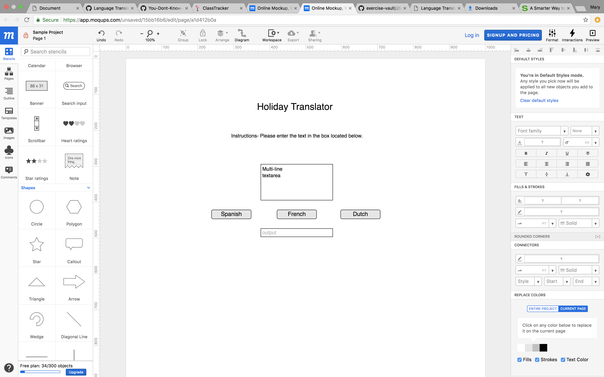
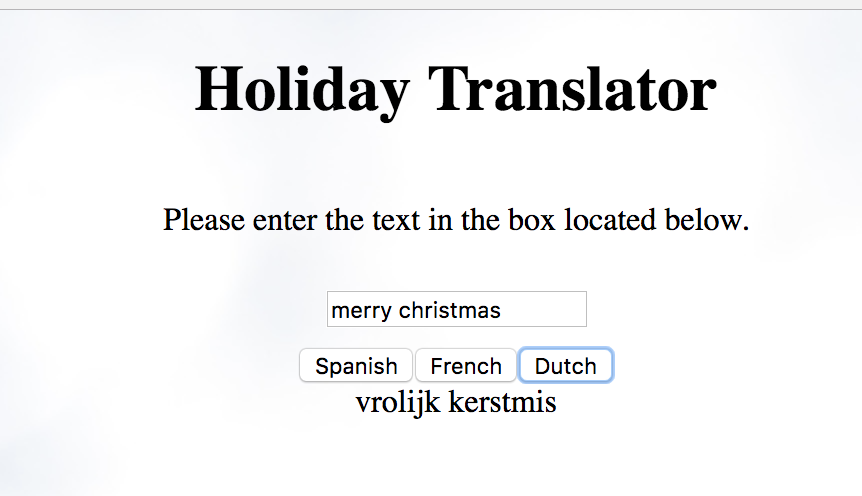

# Holiday Language Translator 

##Description

We made a Holiday Language Translator that translates "Merry Christmas and Happy New Year" in Spanish, Dutch, and French. 

## Screenshots




## How to run this project
* Use npm to intall http-server in your terminal:
```sh
npm install -g http-server
```
* Run the server
```sh
hs -p 9999
```
* Open chrome and navigate to:
```
localhost:9999
```